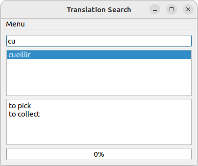
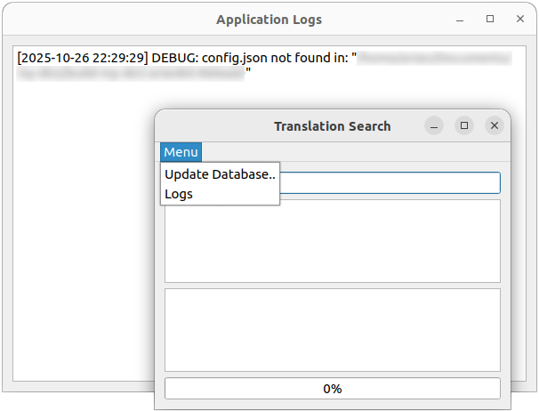

# Simple Qt Dictionary

This desktop application lets you to create simple dictionaries. It connects to an already existing MySQL database and allows you to update it with your new words and their translations. It also provides a simple interface to lookup for a word and to retrieve its translations from the database.

<p align="center">
   
</p>

## Table of Contents

- [Prerequisites](#introduction)
   - [Setting up MySQL server](#setting-up-mysql-server)
      - [Installation on Windows](#installation-on-windows)
      - [Installation on Linux (Debian-based distributions)](#installation-on-linux-debian-based-distributions)
   - [Create database and table](#create-database-and-table)
   - [Create a new user with no password](#create-a-new-user-with-no-password)
- [Compiling the dictionary using Qt Creator](#compiling-and-deploying-the-dictionary-using-qt-creator)
- [Deployment](#deployment)
   - [Deployment on Windows](#deployment-on-windows)
   - [Deployment on Linux (Debian-based distributions)](#deployment-on-linux-debian-based-distributions)
- [Running the application](#running-the-application)

## Prerequisites

### Setting up MySQL server

This application requires to connect to a MySQL server.

#### Installation on Windows

- Go to the MySQL official website [here](https://dev.mysql.com/downloads/installer/)
- Download either the web installer or the full installer and execute it
- During the installation you might be asked to:  
   **Select Configuration Type:** choose **"Development Computer"** or **"Server Computer"**  
   **Connectivity:** leave the default port **3306**  
   **Authentication Method:** choose **"Use Strong Password Encryption"**  
   **Set Root Password:** enter and confirm a secure password for the root user  
   Make sure **"Configure MySQL Server as a Windows Service"** is checked  
   Optionally enable **"Start the MySQL Server at System Startup"**
- Enter MySQL server using:

   ```zsh
   mysql -u root -p
   ```

   If mysql is not recognized, add its path (e.g., `C:\Program Files\MySQL\MySQL Server 8.0\bin`) to the **Environment Variables**. Make sure that `mysql.exe` is located under this folder.

#### Installation on Linux (Debian-based distributions)

On Debian-based distributions, you can install mariadb-server:

```zsh
sudo apt update
sudo apt install mariadb-server
sudo systemctl start mariadb
sudo systemctl enable mariadb
sudo mysql
   ```

### Create database and table

After installing the MySQL server and logging in as `root`, we need to create a database and a table which later the application connects to and communicates with:

```sql
CREATE DATABASE database_name;
CREATE TABLE database_name.table_name (word VARCHAR(255) PRIMARY KEY, translations TEXT);
```

> [!NOTE]
> The database and the table names are arbitrary but the column names should be `word` and `translations`.

### Create a new user with no password
We need to also create a new user with empty password and provide `SELECT`, `INSERT` and `UPDATE` privileges to:

```sql
CREATE USER 'newuser'@'localhost' IDENTIFIED BY '';
GRANT SELECT, INSERT, UPDATE ON database_name.table_name TO 'newuser'@'localhost';
FLUSH PRIVILEGES;
EXIT;
```

## Compiling the dictionary using Qt Creator

- Make sure that **Qt Creator** is installed on your computer
- Open Qt Creator and create a new project using build system `qmake` and base class `QWidget`
- In the Project directory, remove everything including all cpp files and their headers, etc, except for `.pro.user` file
- Copy the files from the repository src directory into the project directory
- If there are any warnings or errors, fix them
- Run the application in the `Debug` mode to verify it is working
- Once ready, switch to `Release` mode and rerun the program

## Deployment

### Deployment on Windows

To import all the required libraries into the exe directory, open the command prompt and run the following code:

```powershell
windeployqt.exe path/to/the/release/exe
```

> [!TIP]
> Usually, the `libmysql.dll` is missing and should be moved to the exe directory manually It could be found under `C:\Program Files\MySQL\MySQL Server\lib`.

### Deployment on Linux (Debian-based distributions)

- Create the required folder structure:

   ```zsh
   mkdir -p my-dict/DEBIAN
   mkdir -p my-dict/usr/local/bin
   mkdir -p my-dict/usr/share/applications
   mkdir -p my-dict/usr/share/icons/hicolor
   ```

- Create a control file under `DEBIAN` (sample available in the repo). For the `Depends` field, you can get them using the command:

   ```zsh
   ldd binary-file
   ```

   Note that there is no need to list every single library. Focus on the high-level packages that the app would not work without.

- Copy the binary file of the release folder under the `bin` directory,
- Create a desktop file under `applications` (sample available in the repo),
- According to the icon dimensions, create appropriate nested folder under `hicolor` and copy the icon file there. For example, if the icon file is of dimensions `512x512`, copy it under `hicolor/512x512/apps`. To get this dimensions:

   ```zsh
   file icon.png
   ```

   Make sure that the icon directory is correctly referenced in the desktop file.

- Change file modes:

   ```zsh
   chmod 755 my-dict/usr/local/bin/binary-file
   chmod 644 my-dict/usr/share/applications/my-dict.desktop
   chmod 644 my-dict/usr/share/icons/hicolor/512x512/apps/icon.png
   ```

- Build the `.deb` file:

   ```zsh
   dpkg-deb --build my-dict
   ```

## Running the application
Before running the application, make sure that you have the configuration file in the same directory as the executable. The configuration file `config.json` should contain the following fields:

```json
{
   "database" : "database_name",
   "table" : "table_name",
   "user" : "user_name",
   "host" : "host_name"
}
```

> [!NOTE]
> These information are already discussed in the sections [Create database and table](#create-database-and-table) and [Create a new user with no password](#create-a-new-user-with-no-password).

After executing the app, in the Menu you will find:

`Update Database..`: Upon clicking, you should provide the path to a plain txt file where you have stored the words and their translations. A sample of this file is available in the repo. Its content looks:
		
```
ferme: farm
cueillir: to pick, to collect
```

> [!TIP]
> The words are separated by a colon from their translations and the translations themselves are separated by commas.

After this step, the MySQL table gets updated and the words can be found by searching in the dictionary search bar.
		
`Logs`: This will open a new window and shows all the logs of the application.

<p align="center">
   
</p>

If you want to remove a word from the database, you need to do it in MySQL server:

```sql
DELETE FROM database_name.table_name WHERE word='---';
```

To drop a database or a table:

```sql
DROP DATABASE database_name;
DROP TABLE table_name;
```

To remove a user:

```sql
DROP USER 'username'@'host';
FLUSH PRIVILEGES;
```